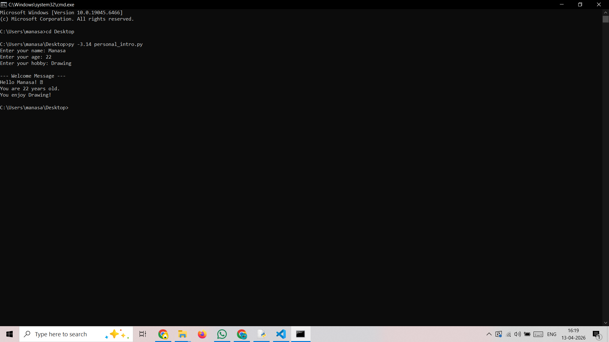

# 🧑‍💻 Personal Introduction Program

## 📌 Project Overview
This project is a beginner-friendly Python application that collects user details (name, age, and hobby) and displays a personalized welcome message.

## 🎯 Objectives
- Learn Python basics
- Understand input/output operations
- Use variables and functions
- Implement loops and conditions

---

## ⚙️ How to Run

1. Make sure Python is installed
2. Run the program:

```bash
py -3.14 personal_intro.py
## 📸 Output Screenshot


